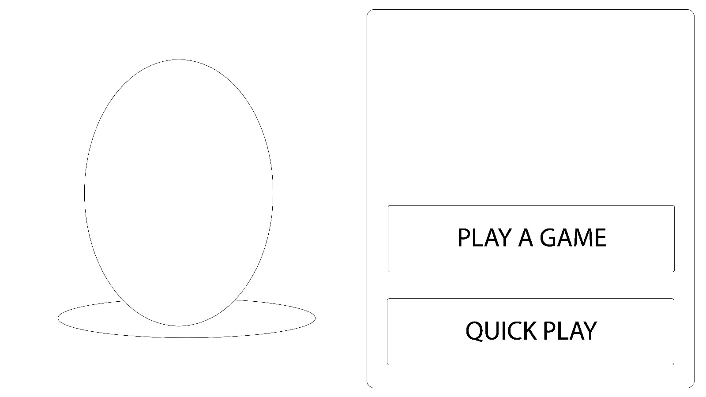
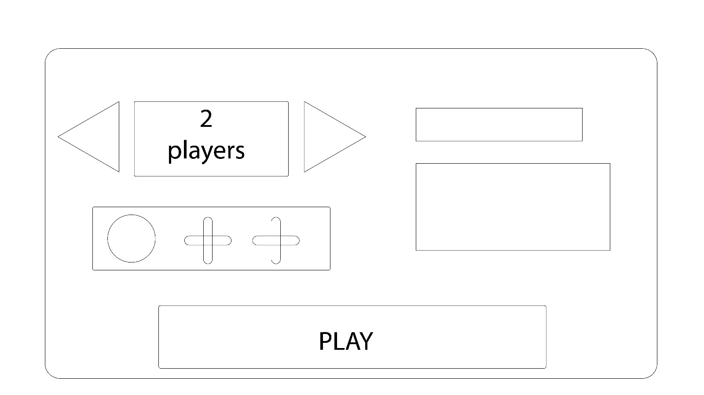

.. toctree::
   :maxdepth: 2

Main Server
===========
This is the server that all clients intitially connect to. For now it will contain lobby making functions as well as character customization and microtransaction facilitation. It will allow players to create or join a game. It will also start the htmc_server binary which houses the actual game.

Login
-----
The main server is responsible for logins as well. However, it always expects at least 8 bytes:
 - size: 2
 - player_id: 4
 - message_type: 2

To solve this we will send null for player_id when we send the login message.

Playing the Game
----------------
The main server binary is always running. For now it will run on the same server. It will take port 9000 and the game server will be given a random port between 9001-9999.

The main screen on the client will have two buttons related to starting the game: Play and Quick Play

Play (Play a Game)
^^^^^^^^^^^^^^^^^^

Typical Flow
~~~~~~~~~~~~
Clicking on the "Play" button brings the player to a lobby screen. The client will send a :code:`SERVER_CREATE_LOBBY` message and have their player_id be the key in the :code:`map_player_id_to_lobby_id` map. Additionally, a map :code:`map_lobby_id_to_player_ids` will have a new lobby added that links back to the players. As the lobby is just an id and not a complex structure there is no need to keep a list of lobbies. The lobby screen looks like this:

Here the player can select the number of players in the game and can even invite their friends to play with them.

If the main player wishes to invite their friend, they will need to first click on the plus icon. The client will send a :code:`SERVER_REQUEST_FRIENDLIST` message to the server. The server will reply with a :code:`SERVER_FRIENDLIST` message containing the friends and their online status (offline / online / in-game). A list will then appear from which the player can then select one online friend to send an invite to.

Once a friend from the list is selected, the client will send a :code:`SERVER_SEND_GAME_INVITE` message containing the friend's name (player_ids are kept private for security reasons). The server will add this invite to a list of pending invites. The friends' client will then receive a game invite (:code:`SERVER_FORWARD_GAME_INVITE` message) which can either be declined (:code:`SERVER_GAME_INVITE_DECLINED` \→ :code:`SERVER_FORWARD_GAME_INVITE_DECLINED`) or accepted (:code:`SERVER_GAME_INVITE_ACCEPTED` \→ :code:`SERVER_LOBBY_UPDATE`). The server will remove the invite from the pending invite list after receiving the response from the friend client. If the friend client accepted, it will not change to the lobby screen until it receives a :code:`SERVER_LOBBY_UPDATE` message. If the friend doesn't accept within a certain amount of time (60 seconds), the invite will become void and a :code:`SERVER_GAME_INVITE_TIMEOUT` message will be sent to both the main client and the friend client. Note that if the player was already in another lobby and they accept the invite, everyone in the lobby will receive a separate :code:`SERVER_LOBBY_UPDATE` message indicating how their lobby has updated.

The main client can also cancel an invite with a :code:`SERVER_CANCEL_GAME_INVITE`. Which would then send a :code:`SERVER_VOID_GAME_INVITE` to the friend client and also remove the invite from the pending invite list. :code:`SERVER_GAME_INVITE_VOIDED` will be sent to the main client to confirm invite cancelation.

Once joined, the main client can send a :code:`SERVER_KICK` message which kicks the friend. The server will send :code:`SERVER_LOBBY_UPDATE` to the friend client. Likewise, the friend can choose to leave the lobby with :code:`SERVER_LEAVE_LOBBY` \→ :code:`SERVER_LOBBY_UPDATE`.

Note: :code:`SERVER_LOBBY_UPDATE` is multipurpose. It will container the full list of players in the lobby and it will be sent to everyone (main client + friend client). As mentioned it will be sent when a friend accepts an invite, when they are kicked from the lobby, and when they leave the lobby themselves.

The lobby itself is the prime resident here. If the creator leaves, any friends that have joined will remain in the room. Remaining players will be promoted to "host" in the order they received invites. Host capabilities involve kicking players and starting the game. When the last player leaves the lobby, it will be removed.

Race conditions
~~~~~~~~~~~~~~~
Due to the nature of the internet, there are a few race conditions that can occur.

As mentioned above, to minimize weird screens on the friend side, the friend will wait for a :code:`SERVER_LOBBY_UPDATE` message from the server before loading the lobby screen.

Let's start by looking at timeouts. The :code:`SERVER_GAME_INVITE_TIMEOUT` message is sent out by the server to both the main client and the friend.

 - If the main client cancels the invite and the timeout message arrives afterwards, the main client can simply ignore that message. Assuming the friend client hasn't accepted / declined the invite (covered next), the friend client can show an "invite expired" notification.
 - If the friend client accepts or declines the invite and then the timeout arrives, the server will not do anything. The friend client can once again simply post the "invite expired" notification.

Now let's look at voiding invites. Recall that the main client expects a :code:`SERVER_GAME_INVITE_VOIDED` confirmation message before updating the UI.

 - If the main client receives a :code:`SERVER_LOBBY_UPDATE` message after it has sent the :code:`SERVER_CANCEL_GAME_INVITE` message, the server has already moved the friend into the lobby. Therefore, the main client will need to add the player to the lobby and display a "Invite cannot be cancelled" notification.
 - If the main client receives a :code:`SERVER_FORWARD_GAME_INVITE_DECLINED` message after it has sent the :code:`SERVER_CANCEL_GAME_INVITE` message, the server has already removed the invite from the active invite list. The main client can therefore remove the pending invite animation as if their cancellation went through (:code:`SERVER_GAME_INVITE_VOIDED`). Note: the timeout case is covered above.
 - If the friend client receives a :code:`SERVER_VOID_GAME_INVITE` message after they have sent the acceptance, they will receive a notification that the invite was voided and they will not join the lobby screen. At this time the server has already voided the invite. Recall that the friend client normally receives a :code:`SERVER_LOBBY_UPDATE` message before switching screens.
 - If the friend client receives a :code:`SERVER_VOID_GAME_INVITE` message after they have declined the invite, the friend client does not need to do anything. At this time the server has already removed the active invite.

The final condition is when all three entities (main client, friend client, and server) all do something at the same time. The only thing that the server does without the action of a client is timeout the invite. Since this architecture is server-authoritative, we will hold true to this and consider the invite as timed out. Each client will then post the appropriate notifications depending on the situation.

Starting the Game
~~~~~~~~~~~~~~~~~
Once the lobby is built, the host (the main client) clicks the "Play" button. The main client will send a :code:`SERVER_PLAY_GAME` to the server. If the room is full the server will immediately start a game for the players in the lobby with a :code:`SERVER_GAME_INFO` message. If there are still empty spots, the server will try to match the players with any other lobbies that are waiting. To let players know they are in a queue the server will send a :code:`SERVER_LOBBY_QUEUED` message. If the game cannot be filled the lobby will be placed in the queue and wait for more lobbies to be created. Whenever the server receives a new :code:`SERVER_PLAY_GAME`, it will look through the lobby queue and try to fill in the longest waiting lobbies with the new players. Note: There is some subtlety to this as lobbies have different player numbers.

Message List
~~~~~~~~~~~~

.. list-table::
   :header-rows: 1

   * - Message
     - Description
     - TxRx (server)
   * - :code:`SERVER_CREATE_LOBBY`
     - Create the lobby
     - Rx
   * - :code:`SERVER_REQUEST_FRIENDLIST`
     - Ask for friendlist including online status
     - Rx
   * - :code:`SERVER_FRIENDLIST`
     - Response to :code:`SERVER_REQUEST_FRIENDLIST`
     - Tx
   * - :code:`SERVER_SEND_GAME_INVITE`
     - Send invite to friend client
     - Rx
   * - :code:`SERVER_FORWARD_GAME_INVITE`
     - Forward invite request
     - Tx
   * - :code:`SERVER_GAME_INVITE_DECLINED`
     - Friend client declined invite
     - Rx
   * - :code:`SERVER_FORWARD_GAME_INVITE_DECLINED`
     - Forward :code:`SERVER_GAME_INVITE_DECLINED`
     - Tx
   * - :code:`SERVER_GAME_INVITE_ACCEPTED`
     - Friend client accepted invite. Triggers :code:`SERVER_LOBBY_UPDATE`.
     - Rx
   * - :code:`SERVER_LOBBY_UPDATE`
     - Update lobby on friend join, on kick, or on leave
     - Tx
   * - :code:`SERVER_CANCEL_GAME_INVITE`
     - Cancel active invite
     - Rx
   * - :code:`SERVER_VOID_GAME_INVITE`
     - Forward invite cancelation
     - Tx
   * - :code:`SERVER_GAME_INVITE_VOIDED`
     - Confirm invite has been voided (sent to host)
     - Tx
   * - :code:`SERVER_KICK`
     - Host (first player) chooses to kick the invited friend. Triggers :code:`SERVER_LOBBY_UPDATE`.
     - Rx
   * - :code:`SERVER_LEAVE_LOBBY`
     - Player leaves lobby. Triggers :code:`SERVER_LOBBY_UPDATE`.
     - Rx
   * - :code:`SERVER_GAME_INVITE_TIMEOUT`
     - Friend did not accept or decline in time.
     - Tx
   * - :code:`SERVER_PLAY_GAME`
     - Start the game already
     - Rx
   * - :code:`SERVER_LOBBY_QUEUED`
     - Lets clients know a match is being formed
     - Tx
   * - :code:`SERVER_GAME_INFO`
     - Gives clients the details for the game instance
     - Tx

Quick Play
^^^^^^^^^^
Now that we understand how the lobby play system works, let's look at Quick Play. The client will immediately send a :code:`SERVER_PLAY_GAME`. Since the server keeps a map of the player_ids mapped to game lobby from the Play button (previous section), the server will look to immediately place the player in a lobby. It will prioritize the longest waiting lobby so that they can start the game faster. If a lobby is found and the game can start immediately the client will receive a :code:`SERVER_GAME_INFO` message immediately. If no lobbies are in the queue, the player will be placed into a separate available quick players queue and will receive a :code:`SERVER_LOBBY_QUEUED` message. If the next :code:`SERVER_PLAY_GAME` is also a quick player they will be matched together in a 1v1. Otherwise, the quick player will be moved to the waiting lobby.

